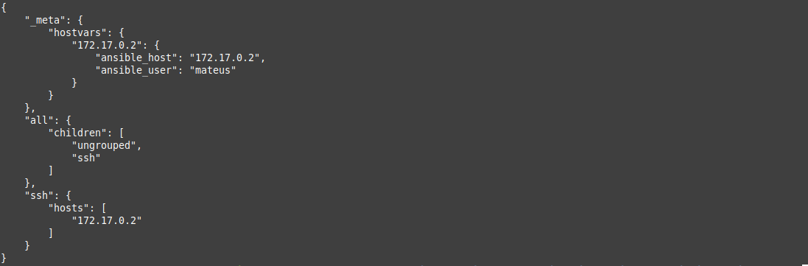
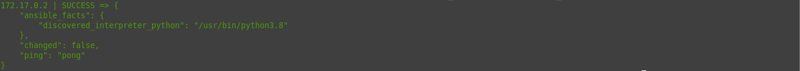
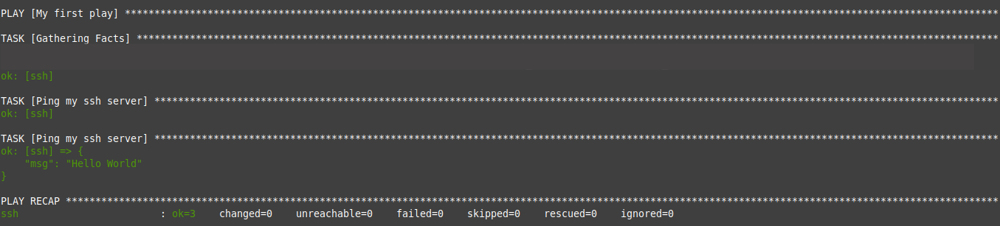

# Construindo um Inventário e Criando um Playbook

## Pré-requisitos

- Rodar containers ou ter provisionado VMs; podes seguir as minhas diretrizes no [README.md](../README.md) principal do repositório sobre como rodar containers com Docker, explico lá;
- Ansible instalado, kkk.

## Construindo um Inventário

O `inventory` é um dos conceitos do Ansible, antes de você testar esse projecto simples, deves saber o conceito por trás dele. Se cumpriste com essa etapa, vamos lá.

### Testando o `inventory.ini` ou `inventory.yml`

Se tiveres tudo a funcionar com base nos pré-requisitos, que explico no [README.md](../README.md). Avance fazendo:

```bash
(venv) $ cd 01-first-inventory-and-playbook/
```

Verifique o inventário:

```bash
(venv) $ ansible-inventory -i inventory.ini --list
```

<div align="center">
    
</div>

Testar ping:

```bash
(venv) $ ansible ssh -m ping -i inventory.ini
```

<div align="center">
    
</div>

## Criando um Playbook

Tal como `inventory`, o `playbook` também é um dos conceitos mais importantes.

### Testando o `playbook.yml`

Para testares, é só fazeres o seguinte dentro do diretório `01-first-inventory-and-playbook/`:

```bash
ansible-playbook -i inventory.ini playbook.yml
```

Saída:

<div align="center">
    
</div>