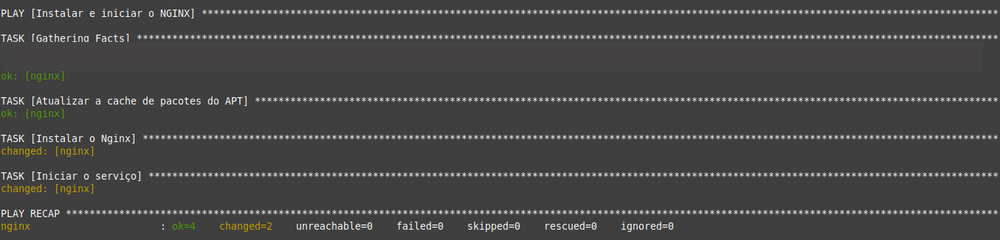

# Automatizando a instalação do Nginx em um Servidor Remoto via SSH

Se você está aqui, espero que tenha passado pelo projecto [01](../01-first-inventory-and-playbook/).

Aqui, você apenas tem que rodar:

```bash
$ docker run -d --name ssh-host2 --hostname ssh-host2 -p 2222:22 -p 8080:80 mateussebastiao/custom-ssh-server
```

Caso já tenha gerado o par de chaves, é só fazer o seguinte:

```bash
$ ssh-copy-id -i ~/.ssh/ansible_key.pub mateus@172.17.0.2
# O IP depende do container, então verifique.
```

> Nota: Tudo acima foi feito e explicado no [README.md](../README.md).

É só rodares dentro do diretório `02-automate-nginx-installation` o seguinte:

```bash
(venv) $ ansible-playbook -i inventory.yml nginx-playbook.yml
```

<div align="center">
    
</div>

Teste no seu navegador com `172.17.0.2:80`, dependendo do seu endereço IP. Saída:

<div align="center">
    
</div>