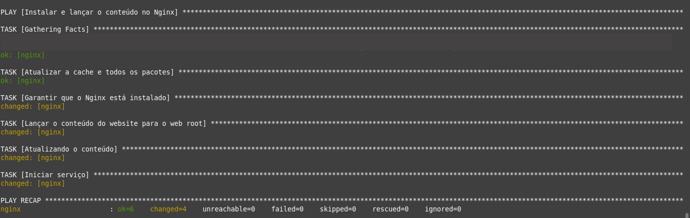
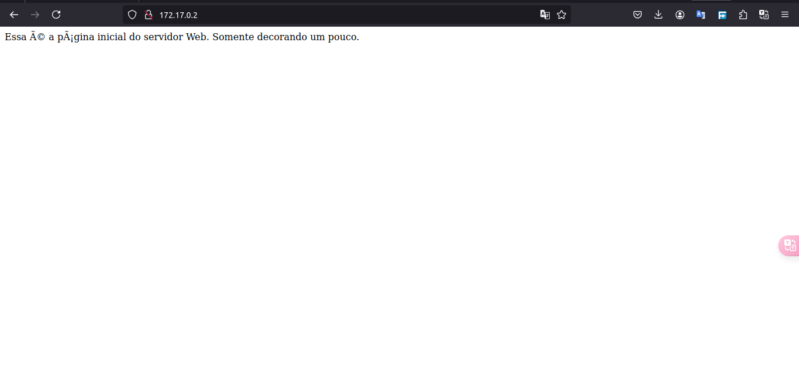

# Explorando o módulo apt

Nesse diretório fui muito mais a fundo e explorei os módulos e principalmente o apt, acabei conhecendo o poder dele e é surreal.

Para rodar o playbook `webservers.yml`, primeiro você deve ter uma VM ou o container que estamos usando até o momento, siga o [README.md principal](../README.md) para saber como...

Para rodar o playbook é só digitares:

```bash
(venv) $ ansible-playbook webservers.yml
```

<div align="center">
    
</div>

Depois é só testar no teu navegador digitando `172.17.0.2:80`:

<div align="center">
    
</div>